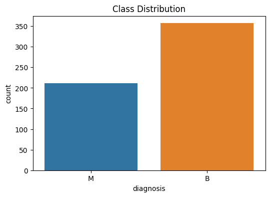
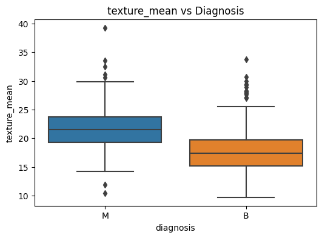
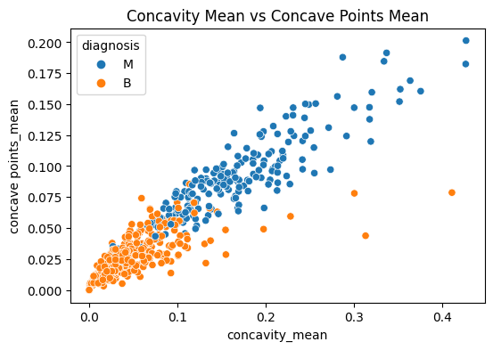

# 🧬 Breast Cancer Detection using Machine Learning

Breast cancer is one of the most common forms of cancer worldwide. Early diagnosis plays a key role in effective treatment and patient survival.  
This project demonstrates the development of a **machine learning pipeline** for breast cancer classification using the **Breast Cancer Wisconsin (Diagnostic) Dataset**.  

The work goes beyond writing code: it shows **data analysis, feature engineering, model building, evaluation, and professional project structuring**.  
It is designed as a **portfolio project** to showcase practical knowledge of **Data Science, Machine Learning, and Software Engineering best practices**.


## 💡 Motivation

Cancer detection using machine learning is not only an academic exercise but a real-world problem with life-saving potential.  
The aim of this project is to simulate how a **data scientist** would approach building a predictive model:  
1. Understanding the problem and dataset  
2. Cleaning and preparing the data  
3. Exploring patterns and relationships with visualization  
4. Building machine learning models  
5. Evaluating results with meaningful metrics  
6. Packaging the project in a way that is **reproducible, transparent, and professional**  


## 📊 Dataset

The dataset is the **Breast Cancer Wisconsin (Diagnostic) Data Set**, available from the [Kaggle](https://www.kaggle.com/datasets/yasserh/breast-cancer-dataset?select=breast-cancer.csv)).

Data sonsists of 569 patients diagnosis results, test data. Out of these 212 patients are diagnosed with cancer. Data consists of 30 dependent variables and one dependent variable. 

- **Features**: tumor properties derived from digitized images (radius, texture, smoothness, compactness, etc.)  
- **Target Variable**:  
  - `M` → Malignant  
  - `B` → Benign  

> The dataset is balanced and widely used for benchmarking binary classification algorithms.


## 🎯 Objectives

- Perform **Exploratory Data Analysis (EDA)** to understand relationships between features  
- Apply **data preprocessing** (handling missing values, scaling, encoding labels)  
- Train multiple ML models (Logistic Regression, Random Forest, SVM, etc.)  
- Evaluate models using **accuracy, precision, recall, F1-score, ROC-AUC**  
- Visualize feature importance and decision boundaries  
- Organize the project into a **production-ready structure** with scripts, tests, and documentation  
- Showcase **best practices** for GitHub portfolio projects  


## 🔬 Methodology

The workflow for this project follows a standard **machine learning lifecycle**:

1. **Data Preprocessing**  
   - Load dataset  
   - Encode target variable (`M` = 1, `B` = 0)  
   - Feature scaling with `StandardScaler`  
   - Train-test split  

2. **Exploratory Data Analysis (EDA)**  
   - Summary statistics  
   - Distribution plots for numerical features  
   - Heatmap of correlations  
   - Class balance check  

3. **Model Training**  
   - Models implemented: Logistic Regression, Random Forest, SVM, KNN  
   - Train each model using training data  
   - Evaluate with cross-validation  

4. **Evaluation Metrics**  
   - Confusion Matrix  
   - Precision, Recall, F1-score  
   - ROC Curve & AUC  

5. **Deployment Readiness**  
   - Model saved using `joblib`  
   - Project structured into scripts + notebook  
   - Future extension for Streamlit/Flask app  


## 📈 Exploratory Data Analysis  

Understanding the dataset is key. Below are some insights and visualizations:  

### 🔹 Class Distribution  
The dataset is slightly imbalanced, with more benign cases:  
  


### 🔹 Feature Relationships  
Malignant tumors generally have larger **radius**, **perimeter**, and **area**. Boxplots below show the difference:  
  
  


### 🔹 Feature Correlation  
Certain features are highly correlated. The heatmap helps identify redundant variables for possible feature reduction (e.g., PCA):  

  


### 🔹 Scatter Example  
Strong separation between malignant and benign tumors is seen when comparing **concavity mean** vs **concave points mean**:  
  


### 🔹 Pairplot of Selected Features  
A multi-feature comparison showing clear clustering of benign vs malignant tumors:  
  


## 🤖 Modeling Results

All models were trained and evaluated. Key metrics:

| Model                | Accuracy | Precision | Recall | F1-Score |
|----------------------|---------|-----------|--------|----------|
| SVC (Linear Kernel)  | **98.2%** | **1.0**   | **0.953** | **0.976** |
| SVC (RBF Kernel)     | 98.2%   | 1.0       | 0.953  | 0.976    |
| Random Forest        | 97.4%   | 1.0       | 0.930  | 0.964    |
| K-Nearest Neighbors  | 95.6%   | 0.952     | 0.930  | 0.941    |
| GaussianNB           | 96.5%   | 0.976     | 0.930  | 0.952    |
| Decision Tree        | 91.2–92.9% | 0.867–0.927 | 0.884–0.907 | 0.886–0.905 |

✅ **Best Model:** `SVC (Linear Kernel)` — highest **recall and F1-score**, critical for cancer detection.  

> Precision = 1.0 → no false positives  
> Recall = 0.953 → very few false negatives  


## 🚀 Future Work  

- Deploy model with **Streamlit** or **Flask** for interactive use  
- Experiment with **deep learning models** (e.g., neural networks)  
- Apply **feature selection** or **PCA** to optimize performance  
- Hyperparameter tuning with **GridSearchCV** or **Optuna**  


## 🙌 Acknowledgments  

- Dataset: [Breast Cancer Wisconsin (Diagnostic)](https://www.kaggle.com/datasets/yasserh/breast-cancer-dataset)  
- Inspiration: Real-world applications of ML in healthcare  

✨ This project shows how machine learning can transform healthcare by making diagnosis **faster, data-driven, and reliable**.  

  


## 🚀 How to Run the Project

```bash
# 1. Clone repo
git clone https://github.com/balajiabcd/Breast-Cancer-Detection.git
cd Breast-Cancer-Detection

# 2. Install dependencies
pip install -r requirements.txt

# 3. Run main pipeline
python main.py

# 4. Run all tests
pytest -v 


