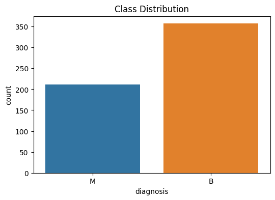
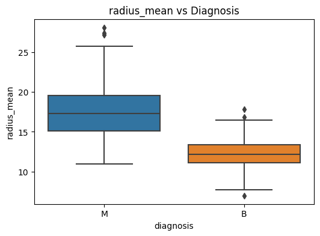
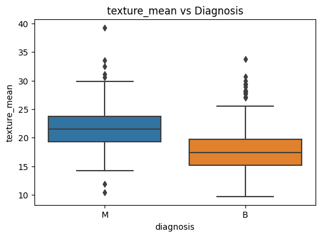
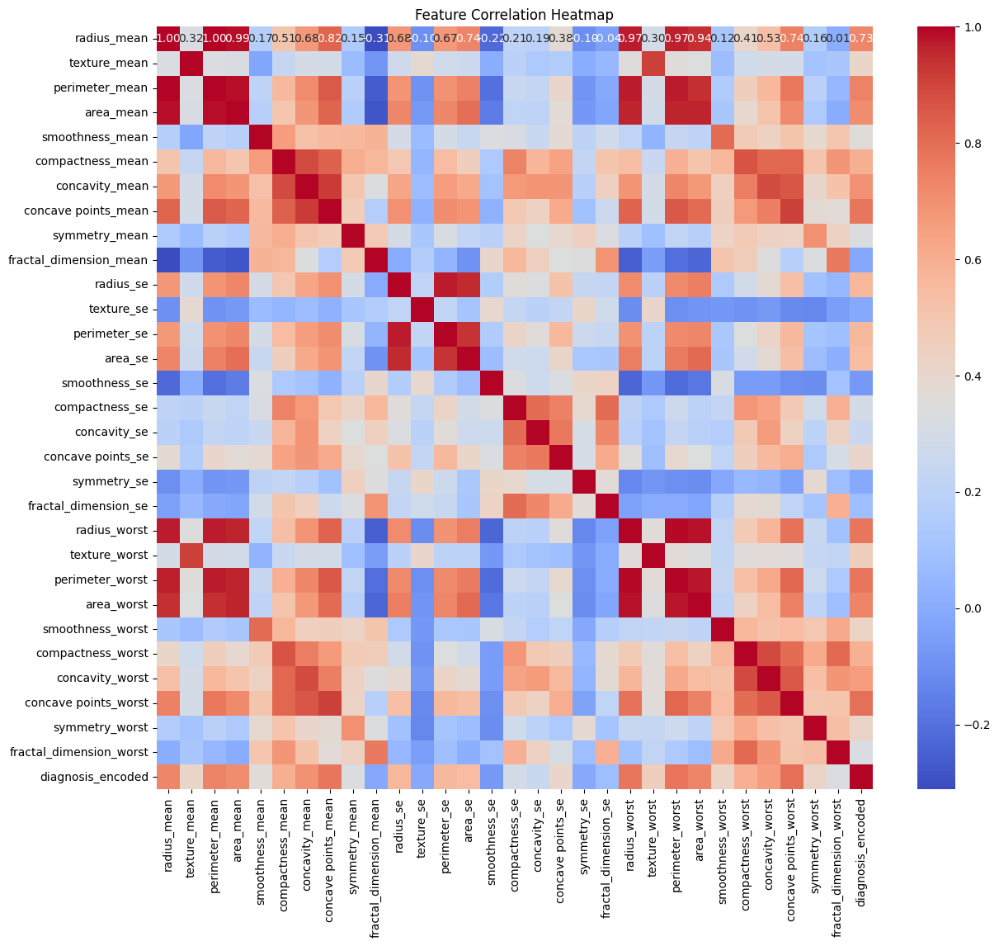
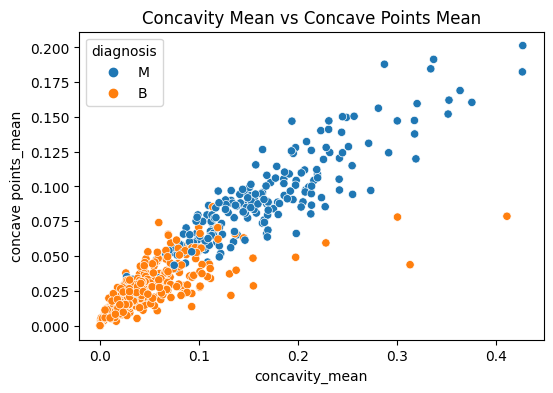
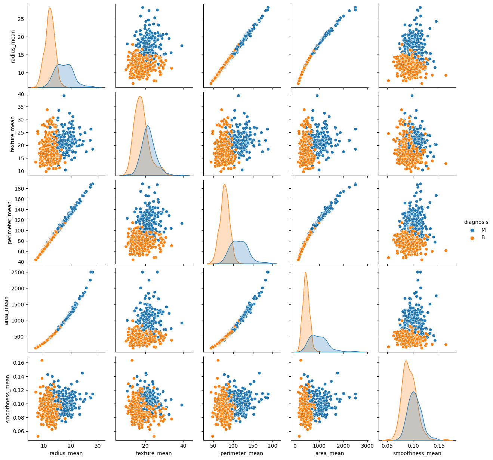

# 🧬 Breast Cancer Detection using Machine Learning

Breast cancer is one of the most common cancers worldwide. Early diagnosis is critical for effective treatment and patient survival.  
This project demonstrates a **machine learning pipeline** for breast cancer classification using the **Breast Cancer Wisconsin (Diagnostic) Dataset**, including **data analysis, feature engineering, model training, evaluation, and professional project structuring**.  
It is designed as a **portfolio project** to showcase practical skills in **Data Science, Machine Learning, and Software Engineering best practices**.

---

## 💡 Motivation

Cancer detection using machine learning has **real-world impact**. The goal is to simulate a data scientist workflow:

1. Understand the problem and dataset  
2. Clean and preprocess the data  
3. Explore patterns using visualization  
4. Train and evaluate multiple ML models  
5. Select the **best-performing model**  
6. Package the project professionally for reproducibility and clarity  

---

## 📊 Dataset

- **Dataset**: Breast Cancer Wisconsin (Diagnostic) Dataset ([Kaggle link](https://www.kaggle.com/datasets/yasserh/breast-cancer-dataset?select=breast-cancer.csv))  
- **Samples**: 569 patients (212 malignant, 357 benign)  
- **Features**: 30 numeric tumor characteristics (radius, texture, smoothness, etc.)  
- **Target variable**:  
  - `M` → Malignant  
  - `B` → Benign  

> The dataset is widely used for binary classification benchmarking.

---

## 🎯 Objectives

- Conduct **Exploratory Data Analysis (EDA)** to understand feature relationships  
- Preprocess data: scaling, encoding, train-test split  
- Train multiple ML models (SVM, Random Forest, KNN, Decision Tree, Naive Bayes)  
- Evaluate models using **accuracy, precision, recall, F1-score, ROC-AUC**  
- Save trained models (`.pkl`) for reuse  
- Organize project structure for clarity and reproducibility  

---

## 🔬 Workflow / Methodology

1. **Data Preprocessing**  
   - Encode target variable (`M` = 1, `B` = 0)  
   - Scale features with `StandardScaler`  
   - Train-test split (80%-20%)  

2. **Exploratory Data Analysis**  
   - Summary statistics and distributions  
   - Class distribution plots  
   - Correlation heatmap  
   - Scatter plots and pairplots for selected features  

3. **Model Training**  
   - Models implemented: SVM, Random Forest, KNN, Decision Tree, Naive Bayes  
   - Trained on processed data and evaluated using multiple metrics  

4. **Evaluation Metrics**  
   - Confusion Matrix  
   - Accuracy, Precision, Recall, F1-score  
   - ROC-AUC (optional)  

5. **Deployment Readiness**  
   - Save the **best model** using `joblib`  
   - Professional project structure with scripts, notebooks, images, and tests  

---

## 📈 Exploratory Data Analysis

### 🔹 Class Distribution
The dataset has more benign cases:  
  

### 🔹 Feature Relationships
Malignant tumors generally have higher **radius**, **perimeter**, and **area**:  
  
  

### 🔹 Feature Correlation
Heatmap helps identify redundant features for possible reduction (e.g., PCA):  
  

### 🔹 Scatter Example
Comparison of **concavity mean** vs **concave points mean** shows separation between malignant and benign tumors:  
  

### 🔹 Pairplot of Selected Features
Multi-feature comparison showing clear clustering:  
  

---

## 🤖 Modeling Results

All models were trained and evaluated. Key metrics:

| Model                | Accuracy | Precision | Recall | F1-Score |
|----------------------|---------|-----------|--------|----------|
| SVC (Linear Kernel)  | **98.2%** | **1.0**   | **0.953** | **0.976** |
| SVC (RBF Kernel)     | 98.2%   | 1.0       | 0.953  | 0.976    |
| Random Forest        | 97.4%   | 1.0       | 0.930  | 0.964    |
| K-Nearest Neighbors  | 95.6%   | 0.952     | 0.930  | 0.941    |
| GaussianNB           | 96.5%   | 0.976     | 0.930  | 0.952    |
| Decision Tree        | 91.2–92.9% | 0.867–0.927 | 0.884–0.907 | 0.886–0.905 |

✅ **Best Model:** `SVC (Linear Kernel)` — highest **recall and F1-score**, critical for cancer detection.  

> Precision = 1.0 → no false positives  
> Recall = 0.953 → very few false negatives  

---

## 🚀 How to Run the Project

```bash
# 1. Clone repo
git clone https://github.com/balajiabcd/Breast-Cancer-Detection.git
cd Breast-Cancer-Detection

# 2. Install dependencies
pip install -r requirements.txt

# 3. Run main pipeline
python main.py

# 4. Run all tests
pytest -v
