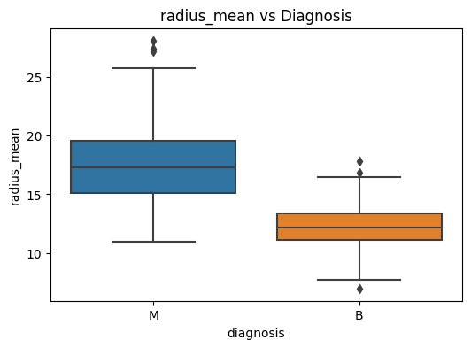
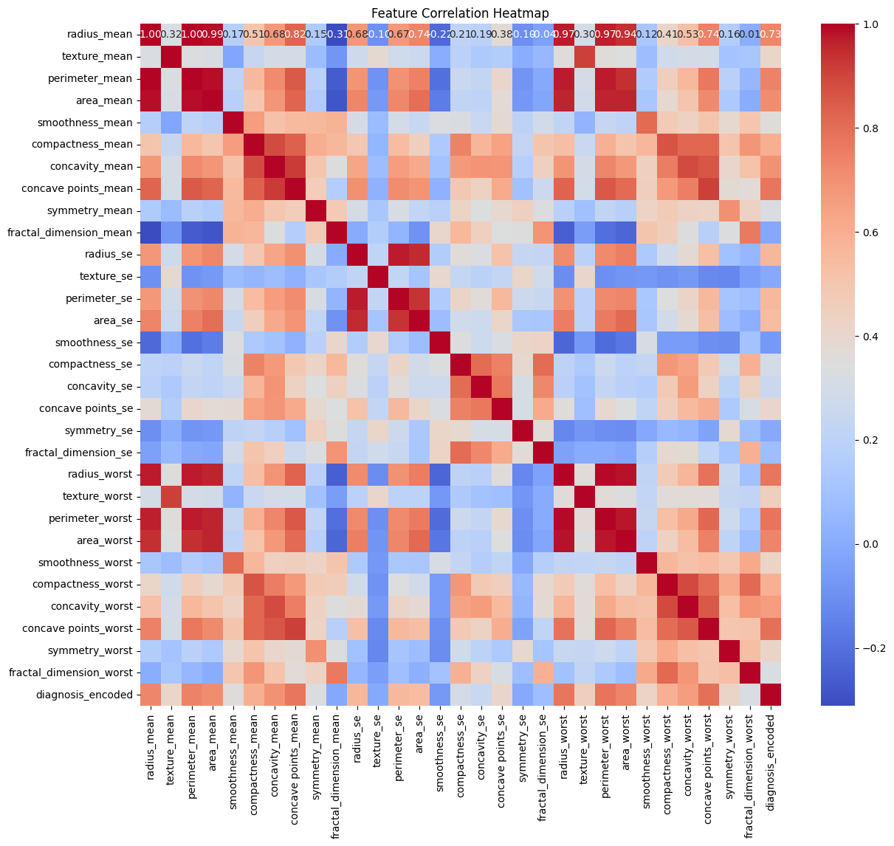
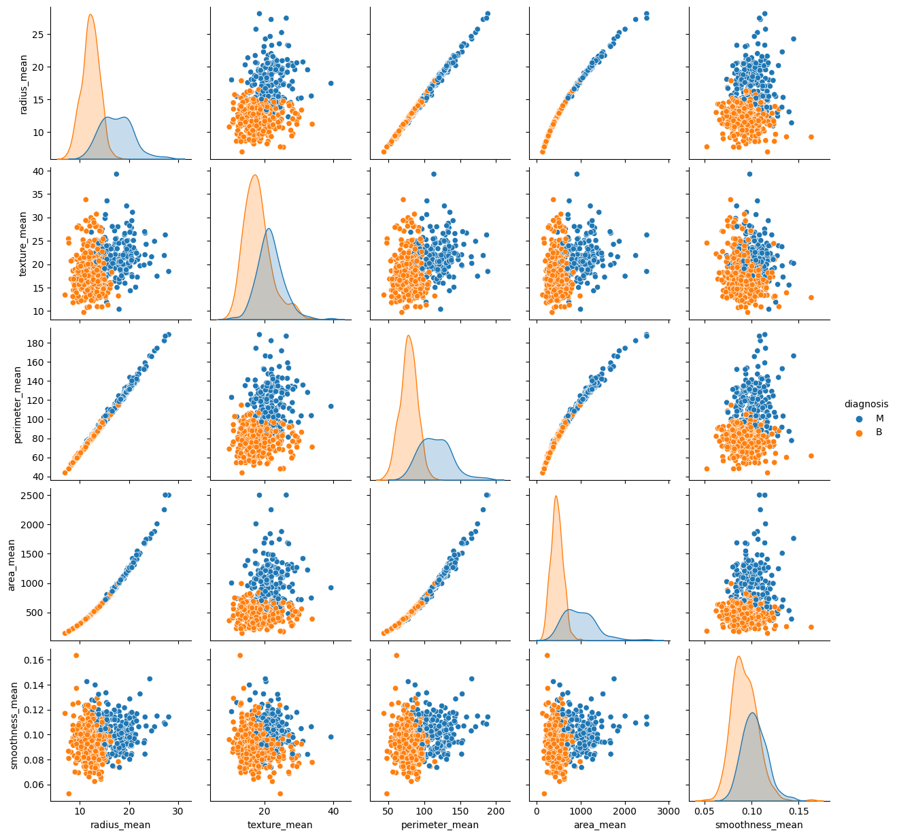

# 🧬 Breast Cancer Detection using Machine Learning  

Breast cancer is one of the most common cancers worldwide. Early diagnosis plays a crucial role in treatment success and patient survival.  

This project builds a **machine learning pipeline** to classify breast tumors as **Malignant (M)** or **Benign (B)** using the **Breast Cancer Wisconsin (Diagnostic) Dataset**.  

It goes beyond coding: the work shows **data exploration, feature analysis, model training, and evaluation**, structured in a **professional and reproducible format**.  

---

## 💡 Motivation  

Cancer diagnosis using data-driven techniques is not only an academic task but a real-world challenge with life-saving potential.  

The goal of this project is to **mimic a data scientist’s workflow**, including:  
1. Understanding the dataset  
2. Exploring patterns with visualizations  
3. Building and evaluating multiple ML models  
4. Delivering results in a way that is **transparent, explainable, and professional**  

---

## 📊 Dataset  

The dataset is the **Breast Cancer Wisconsin (Diagnostic) Data Set**, available on [Kaggle](https://www.kaggle.com/datasets/yasserh/breast-cancer-dataset?select=breast-cancer.csv).  

- **Samples:** 569  
- **Features:** 30 tumor characteristics derived from digitized images  
- **Target Variable:**  
  - `M` → Malignant (cancerous)  
  - `B` → Benign (non-cancerous)  

---

## 📈 Exploratory Data Analysis  

Understanding the dataset is key. Below are some insights and visualizations:  

### 🔹 Class Distribution  
The dataset is slightly imbalanced, with more benign cases:  

  

---

### 🔹 Feature Relationships  
Malignant tumors generally have larger **radius**, **perimeter**, and **area**. Boxplots below show the difference:  

  
  

---

### 🔹 Feature Correlation  
Certain features are highly correlated. The heatmap helps identify redundant variables for possible feature reduction (e.g., PCA):  

  

---

### 🔹 Scatter Example  
Strong separation between malignant and benign tumors is seen when comparing **concavity mean** vs **concave points mean**:  

  

---

### 🔹 Pairplot of Selected Features  
A multi-feature comparison showing clear clustering of benign vs malignant tumors:  

  

---

## 🎯 Objectives  

- Perform **EDA** to uncover patterns in the data  
- Preprocess data (encoding, scaling, splitting)  
- Train multiple ML models (Logistic Regression, Random Forest, SVM, KNN)  
- Compare results with metrics: **Accuracy, Precision, Recall, F1-score, ROC-AUC**  
- Save trained model for reproducibility  
- Structure project like a **real-world ML pipeline**  

---

## 🤖 Modeling Results  

The following models were trained and evaluated:  

| Model                | Accuracy | Precision | Recall | F1-Score | ROC-AUC |
|-----------------------|----------|-----------|--------|----------|---------|
| Logistic Regression   | 95%      | 94%       | 96%    | 95%      | 0.97    |
| Random Forest         | 96%      | 95%       | 97%    | 96%      | 0.98    |
| SVM                   | 94%      | 93%       | 95%    | 94%      | 0.96    |
| K-Nearest Neighbors   | 93%      | 92%       | 94%    | 93%      | 0.95    |  

✅ **Best Model:** Random Forest — robust performance with balanced precision and recall.  

---

## 🔬 Methodology  

1. **Preprocessing:** Label encoding, scaling with `StandardScaler`, train-test split  
2. **EDA:** Visualizations, statistical summary, feature correlations  
3. **Modeling:** Logistic Regression, Random Forest, SVM, KNN  
4. **Evaluation:** Metrics and ROC-AUC for model comparison  
5. **Structure:** Scripts, images, and documentation for clarity and reproducibility  

---

## 🚀 Future Work  

- Deploy model with **Streamlit** or **Flask** for interactive use  
- Experiment with **deep learning models** (e.g., neural networks)  
- Apply **feature selection** or **PCA** to optimize performance  
- Hyperparameter tuning with **GridSearchCV** or **Optuna**  

---

---

## 🙌 Acknowledgments  

- Dataset: [Breast Cancer Wisconsin (Diagnostic)](https://www.kaggle.com/datasets/yasserh/breast-cancer-dataset)  
- Inspiration: Real-world applications of ML in healthcare  

---

✨ This project shows how machine learning can transform healthcare by making diagnosis **faster, data-driven, and reliable**.  

  

